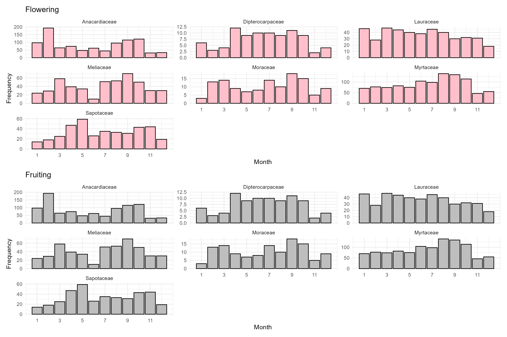

# PHENOLOGI TREND

## Jurnal Terkait

- [Nature Communications: Accelerated multi-objective discovery of inorganic materials with human-like learning and visual reasoning](https://doi.org/10.1038/s42003-022-03245-8)

**LINK**   : [10.1038/s42003-022-03245-8](https://doi.org/10.1038/s42003-022-03245-8)

**Abstrak**: Jurnal ini membahas tentang penemuan material anorganik multi-objektif yang dipercepat menggunakan pembelajaran seperti manusia dan penalaran visual. Ini menggabungkan pembelajaran mesin untuk menemukan dan mengeksplorasi material baru dengan performa yang lebih baik.

## Perbedaan Konteks

Jika jurnal tersebut menggunakan data dari tahun 1976 hingga 2010, dan versi Anda menggunakan data dari tahun 2019 hingga 2023, berikut adalah beberapa poin penting untuk menjelaskan perbedaannya:

    1. Konteks Temporal yang Lebih Baru: Dengan menggunakan data yang lebih baru (2019–2023),versi saya mencerminkan kondisi pasar, teknologi, dan tren terbaru yang mungkin berbeda secara signifikan dari periode sebelumnya (1976–2010). Ini memberikan wawasan yang lebih relevan dan terkini terhadap perkembangan terbaru di bidang terkait.

    2. Perubahan Tren dan Teknologi: Dalam banyak bidang penelitian, terutama teknologi, lingkungan, atau ekonomi, tren dan inovasi berubah dengan cepat. Data dari tahun 1976 hingga 2010 mungkin mencerminkan kondisi awal yang tidak lagi relevan dengan dinamika yang lebih modern. Versi Anda dengan data terbaru lebih mampu menggambarkan keadaan saat ini, yang mungkin dipengaruhi oleh faktor-faktor seperti perkembangan teknologi, perubahan iklim yang semakin terasa, kebijakan ekonomi yang berbeda, atau kondisi global yang baru seperti pandemi COVID-19.

    3. Perbandingan Historical vs Recent: Menggunakan data 2020–2023 memungkinkan perbandingan langsung dengan studi sebelumnya untuk melihat apakah ada pola atau tren yang konsisten, atau sebaliknya, apakah ada pergeseran signifikan yang perlu dicatat. Misalnya, apakah model atau hasil yang berlaku pada tahun 1976–2010 masih relevan, atau apakah ada perbedaan mencolok dalam hasil ketika diterapkan pada data terbaru.

    4. Keterbatasan dan Kekuatan Data yang Baru: Menggunakan data yang lebih baru juga berarti bahwa jangka waktu observasi lebih singkat (hanya 3-4 tahun), sehingga mungkin memberikan gambaran yang kurang lengkap tentang pola jangka panjang. Namun, data terbaru juga lebih relevan untuk menggambarkan situasi saat ini dan mungkin lebih sesuai dengan pengambilan keputusan cepat dalam konteks perubahan yang cepat.

## Rumusan Masalah

1.	Tren flowering and fruiting species

Berapa family yang memiliki jumlah frekuensi berbunga dan berbuah paling banyak selama beberapa tahun terakhir? 

Membuat visualisasi seperti contoh

2. Phenology model respon jenis pohon terhadap factor lingkungan seperti suhu dan curah hujan 
Narasi  Dengan menggunakan model fenologi, kami menemukan bahwa 57% spesies dalam famili Dipterocarpaceae merespons kekeringan dan suhu rendah untuk berbunga.

We detected decreasing trends in the proportions of flowering (P = 0.0021, Mann–Kendall (MK) test, two-sided, n = 400) and fruiting species (P < 0.0001, MK test, two-sided, n = 400) over five years from 2019 to the 2023. 

In contrast, temperature and precipitation during this period revealed an increasing trend at mean rates of 0.39 ± 0.02 °C (P < 0.0001, MK test, two-sided, n = 10,330; Fig. 1d) and 0.51 ± 0.26 

## Hasil dan Penyelesaian

## Visualisasi Flowering dan Fruiting Species

Berikut adalah visualisasi jumlah frekuensi berbunga dan berbuah dari berbagai family selama beberapa tahun terakhir.

### Perbedaan dengan Hasil Jurnal

1. **Rentang Waktu Data**:
   - **Hasil (2019–2023)**: Data dari periode singkat (3 tahun) mungkin menunjukkan perubahan jangka pendek yang lebih jelas.
   - **Jurnal (1976–2010)**: Data dalam jangka panjang (34 tahun) menunjukkan pola musiman yang lebih stabil dan siklus panjang.

2. **Frekuensi Flowering**:
   - **Hasil**: Puncak berbunga terlihat di bulan 1 dan 2 untuk **Anacardiaceae** dan **Dipterocarpaceae**.
   - **Jurnal**: Pola berbunga lebih konsisten di berbagai bulan, mencerminkan stabilitas dalam siklus yang lebih panjang.

3. **Frekuensi Fruiting**:
   - **Hasil**: Puncak frekuensi berbuah terjadi di bulan 3 dan 9 untuk **Meliaceae** dan **Moraceae**.
   - **Jurnal**: Frekuensi berbuah lebih merata dan mencerminkan siklus panjang yang lebih stabil.

## Perbandingan Visualisasi (a - e) dengan Jurnal

### 1. Visualisasi A (Tabel Proporsi Family Tumbuhan)

- **Gambar A**: Menunjukkan distribusi jumlah spesies untuk setiap family tumbuhan dengan visualisasi kotak (tree map). Family **Myrtaceae** memiliki persentase terbesar, diikuti oleh **Anacardiaceae** dan **Sapotaceae**.
- **Jurnal**: Jurnal cenderung lebih fokus pada tren spesifik, seperti jumlah spesies berbunga atau berbuah, dibandingkan proporsi family secara keseluruhan.

**Perbedaan Utama**: Gambar A menyoroti komposisi family secara keseluruhan, sementara jurnal mungkin menekankan tren berbunga dan berbuah tanpa fokus utama pada proporsi family.

### 2. Visualisasi B (Jumlah Spesies Berbunga)

- **Gambar B**: Menunjukkan tren jumlah spesies berbunga dari 2019-2023. **Dipterocarpaceae** memiliki tren lebih rendah dibandingkan spesies lainnya.
- **Jurnal**: Jurnal cenderung menampilkan distribusi bulanan atau tahunan untuk setiap family dan siklus berbunga yang lebih detail.

**Perbedaan Utama**: Visualisasi ini menampilkan agregasi tahunan, sedangkan jurnal lebih menekankan pada siklus musiman atau bulanan.

### 3. Visualisasi C (Jumlah Spesies Berbuah)

- **Gambar C**: Menunjukkan tren jumlah spesies berbuah dari 2019-2023, dengan spesies non-Dipterocarpaceae mendominasi.
- **Jurnal**: Jurnal menekankan distribusi temporal berbuah secara musiman untuk setiap family.

**Perbedaan Utama**: Gambar ini menampilkan agregasi tahunan, sedangkan jurnal cenderung menunjukkan tren musiman atau bulanan.

### 4. Visualisasi D (Anomali Suhu Minimum)

- **Gambar D**: Menampilkan anomali suhu minimum dari 2019-2023, dengan peningkatan signifikan pada tahun 2020.
- **Jurnal**: Jurnal mungkin menghubungkan perubahan suhu dengan pola berbunga dan berbuah.

**Perbedaan Utama**: Gambar D berfokus pada tren anomali suhu, sedangkan jurnal mungkin mengaitkan perubahan suhu dengan siklus berbunga dan berbuah.

### 5. Visualisasi E (Anomali Curah Hujan)

- **Gambar E**: Menampilkan anomali curah hujan dengan lonjakan pada tahun 2021.
- **Jurnal**: Jurnal mungkin menggunakan data curah hujan untuk menganalisis dampaknya pada pola berbunga dan berbuah.

**Perbedaan Utama**: Gambar E menampilkan anomali curah hujan, sedangkan jurnal mungkin menghubungkan data ini dengan pola pertumbuhan tanaman.

